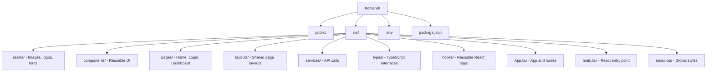

## Frontend — React + TypeScript

```mermaid
flowchart TD
    A["frontend/"] --> B["public/"]
    A --> C["src/"]
    A --> D[".env"]
    A --> E["package.json"]

    C --> F["assets/ - Images, logos, fonts"]
    C --> G["components/ - Reusable UI"]
    C --> H["pages/ - Home, Login, Dashboard"]
    C --> I["layouts/ - Shared page layouts"]
    C --> J["services/ - API calls"]
    C --> K["types/ - TypeScript interfaces"]
    C --> L["hooks/ - Reusable React logic"]
    C --> M["App.tsx - App and routes"]
    C --> N["main.tsx - React entry point"]
    C --> O["index.css - Global styles"]
```

