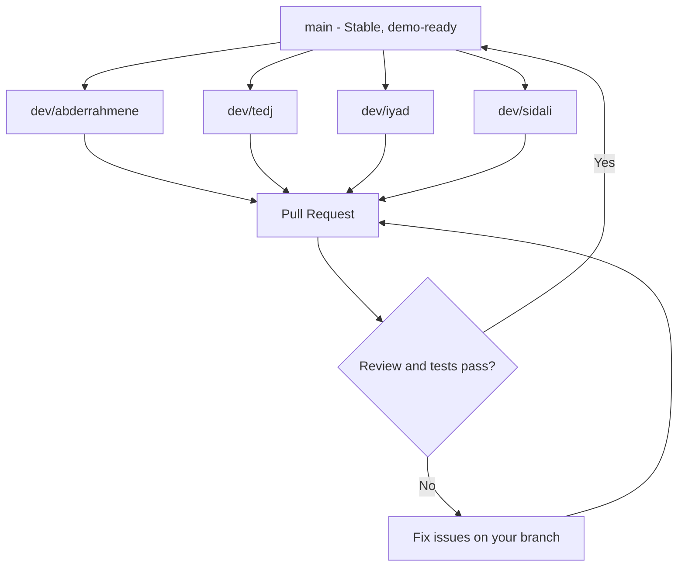
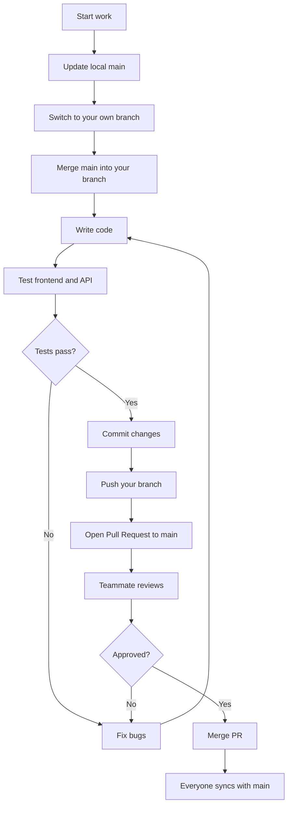
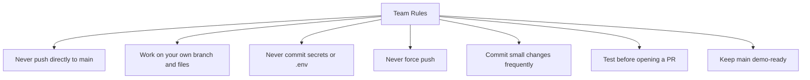
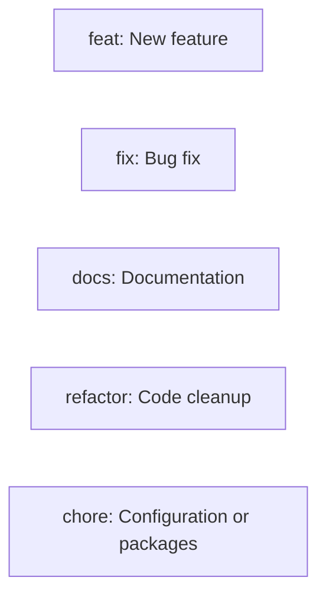

# Git Workflow

## 1. Branch Structure

```mermaid
flowchart TD
    M["main - Stable, demo-ready"]

    M --> A["dev/abderrahmene"]
    M --> B["dev/tedj"]
    M --> C["dev/iyad"]
    M --> D["dev/sidali"]

    A --> E["Pull Request"]
    B --> E
    C --> E
    D --> E

    E --> F{"Review and tests pass?"}
    F -->|Yes| M
    F -->|No| G["Fix issues on your branch"]
    G --> E
```

## 2. Development Workflow

```mermaid
flowchart TD
    A["Start work"] --> B["Update local main"]
    B --> C["Switch to your own branch"]
    C --> D["Merge main into your branch"]
    D --> E["Write code"]
    E --> F["Test frontend and API"]
    F --> G{"Tests pass?"}
    G -->|No| H["Fix bugs"]
    H --> E
    G -->|Yes| I["Commit changes"]
    I --> J["Push your branch"]
    J --> K["Open Pull Request to main"]
    K --> L["Teammate reviews"]
    L --> N{"Approved?"}
    N -->|No| H
    N -->|Yes| O["Merge PR"]
    O --> P["Everyone syncs with main"]
```

## 3. Rules

```mermaid
flowchart TD
    A["Team Rules"] --> B["Never push directly to main"]
    A --> C["Work on your own branch and files"]
    A --> D["Never commit secrets or .env"]
    A --> E["Never force push"]
    A --> F["Commit small changes frequently"]
    A --> G["Test before opening a PR"]
    A --> H["Keep main demo-ready"]
```

## 4. Commit Convention

```mermaid
flowchart LR
    A["feat: New feature"]
    B["fix: Bug fix"]
    C["docs: Documentation"]
    D["refactor: Code cleanup"]
    E["chore: Configuration or packages"]
```
